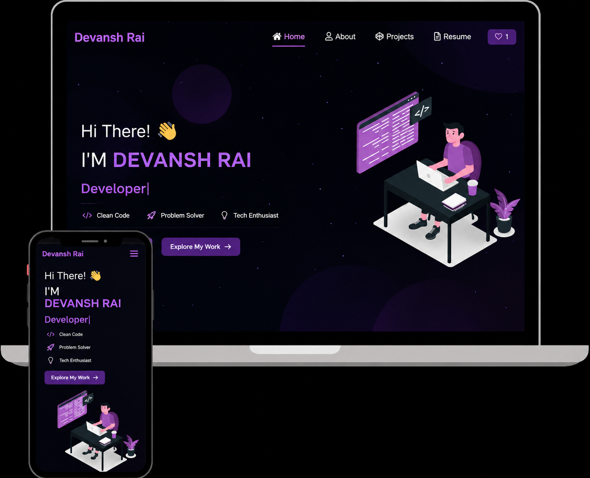

<h2 align="center">
  🚀 Personal Portfolio — v1.0
  <br/><br/>
  <a href="https://devanshrai.vercel.app/" target="_blank">🌐 devanshrai.tech</a>
</h2>

<div align="center">
  
</div>

<br/>

<div align="center">

[](https://forthebadge.com)&nbsp;
[](https://forthebadge.com)&nbsp;
[](https://forthebadge.com)

</div>

<div align="center">
  <a href="https://github.com/devanshrai/Portfolio/issues">🐛 Report a Bug</a> &nbsp;|&nbsp;
  <a href="https://github.com/devanshrai/Portfolio/issues">✨ Request a Feature</a> &nbsp;|&nbsp;
  <a href="https://devanshrai.vercel.app/" target="_blank">🔗 Live Demo</a>
</div>

---

## 👋 About This Project

A clean, responsive personal portfolio built to showcase my projects, skills, and resume — all in one place. Designed with simplicity and clarity in mind, it gives visitors a quick and pleasant way to learn about me and my work.

> Feel free to **fork this repo** and make it your own!  
> If you do, please credit [Devansh Rai](https://github.com/devanshrai/Portfolio) — it's appreciated. 🙏

---

## 🛠 Built With

| Technology | Purpose |
|:---:|:---:|
| ⚛️ React.js | Frontend UI |
| 🟢 Node.js | Runtime |
| 🚂 Express.js | Backend |
| 🎨 CSS3 | Styling |
| 💻 VS Code | Editor |
| ▲ Vercel | Deployment |

---

## ✨ Features

- 📖 **Multi-Page Layout** — Smooth navigation across sections
- 🎨 **Styled with React-Bootstrap & CSS** — Easy to customize colors and themes
- 📱 **Fully Responsive** — Looks great on all screen sizes
- ⚡ **Fast & Lightweight** — Optimized for performance

---

## 🚀 Getting Started

Make sure you have **Node.js** and **Git** installed on your machine, then follow the steps below.

### Installation

```bash
# 1. Clone the repository
git clone https://github.com/devanshrai/Portfolio.git

# 2. Navigate into the project folder
cd Portfolio

# 3. Install dependencies
npm install

# 4. Start the development server
npm start
```

Open [http://localhost:3000](http://localhost:3000) in your browser to see it live.  
The page will auto-reload whenever you make edits. ✅

---

## 📁 Customization

Navigate to `/src/components/` — all the components are organized there.  
Edit your personal info, projects, and skills directly in the relevant component files.

---

## 🤝 Show Your Support

If you found this helpful or inspiring, consider giving it a ⭐ on GitHub — it means a lot!

<div align="center">

Made with ❤️ by [Devansh Rai](https://github.com/devanshrai)

</div>